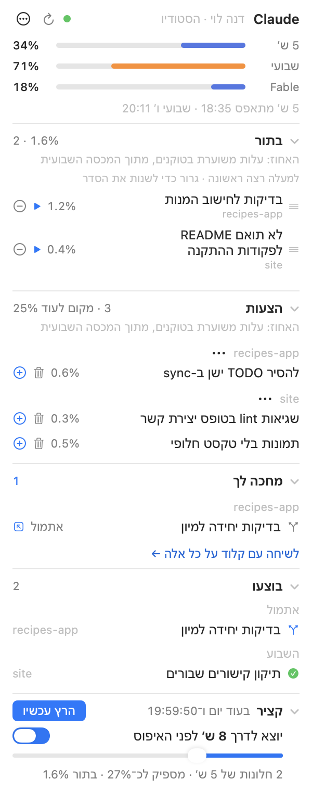

<div dir="rtl">

# קציר מכסה — Quota Harvest

ווידג'ט לשורת התפריט של המק, בשביל [Claude Code](https://claude.com/claude-code). הוא מראה כמה מהמכסה של התוכנית שלך כבר נוצלה — חלון חמש השעות, המכסה השבועית והמכסה השבועית של מודל מסוים — ומנצל את המכסה השבועית שהייתה הולכת לאיבוד באיפוס על משימות קטנות מהפרויקטים שלך. כל משימה בענף משלה, ושום דבר לא ממוזג בלי אישור שלך.

בעברית או באנגלית. [English](README.md)



## מה הוא עושה

- **המכסה במבט אחד.** שלושה פסים בחלון (או שלושה שעונים קטנים בשורת התפריט), כתום מ-70% ואדום מ-90%, עם זמני האיפוס.
- **בקלוג שמתמלא לבד.** אחרי ההתקנה, כל שיחה של Claude Code (וגם Codex) יודעת לרשום בקובץ `BACKLOG.md` של הפרויקט דברים קטנים שהיא שמה לב אליהם — בדיקה חסרה, README לא מעודכן, TODO — במקום לעשות אותם עכשיו או לשכוח. אפשר גם פשוט להגיד "תוסיף לבקלוג".
- **הצעות שאתה מאשר.** משימות שסוכן רושם לבד מגיעות כהצעות. ⊕ מעביר הצעה לתור; פח מוחק אותה; ואפשר להוציא פרויקט שלם מההצעות.
- **הקציר.** כמה שעות לפני האיפוס השבועי (אתה קובע כמה), הווידג'ט מפעיל שיחת Claude Code שעוברת על התור, משימה אחרי משימה, כמה שהמכסה שנשארה מאפשרת. משימה שלא תספיק להסתיים לפני האיפוס לא מתחילה. אפשר גם להריץ את התור מיד.
- **חי, וגם בטלפון.** כל ריצה מופיעה באפליקציית Claude ובטלפון בזמן שהיא עובדת, ואפשר לכתוב לה.
- **אתה ממזג.** כל משימה נגמרת בענף `backlog/…` משלה בתוך הפרויקט. הקציר לא דוחף ולא ממזג כלום. "מחכה לך" פותח שיחה שמראה את השינוי וממזגת רק כשאתה מאשר; ואם משהו מחכה יותר מדי זמן, מגיעה תזכורת.

## מה צריך

- macOS 15 ומעלה
- כלי הפיתוח של Xcode (`xcode-select --install`) — בשביל `swiftc` ו-`python3`
- [Claude Code](https://claude.com/claude-code) מחובר עם חשבון claude.ai
- git

## התקנה

</div>

```sh
git clone https://github.com/yairixStudio/quota-harvest.git
cd quota-harvest
./install
```

<div dir="rtl">

`./install` בונה את האפליקציה ומפעיל אותה, גם בכל כניסה למחשב. בפעם הראשונה macOS ישאל אם מותר לה לקרוא את פרטי ההתחברות של Claude Code ב-Keychain — בוחרים **Always Allow**. מכאן פסי המכסה עובדים.

אחר כך לוחצים בחלון על **"הגדר את הקציר…"**. ההגדרה שואלת שם, שפה, תיקייה שבה ירוצו שיחות הקציר, ומייל לסיכום שבועי (לא חובה) — ומראה בדיוק מה ייכתב לפני שהיא כותבת משהו: את מנוע הקציר ושלושה סקילים ב-`~/.claude`, את הפקודה `claude-harvest` ב-`~/.local/bin`, וקטע קצר ומסומן בשם "Backlog" ב-`~/.claude/CLAUDE.md` (וב-`~/.codex/AGENTS.md` אם יש Codex) שמלמד שיחות לרשום משימות. כל קובץ שמוחלף נשמר קודם בגיבוי.

בסוף ההתקנה אפשר להתחיל שיחת היכרות קצרה באפליקציית Claude: היא מוצאת את הפרויקטים שעבדת עליהם, שואלת על אילו לעבוד, קוראת אותם בלי לשנות כלום, ורושמת כמה משימות ראשונות כהצעות.

## שימוש

- **בתור** — משימות שאישרת, העליונה ראשונה, עם ההערכה כמה מהמכסה השבועית כל אחת תעלה. הן רצות לפי חשיבות, אלא אם גוררים אותן לסדר משלך. ▶ מריץ אחת עכשיו; ⊖ מוציא מהתור.
- **הצעות** — ⊕ = אישור, פח = מחיקה, ⋯ ליד פרויקט = "בלי הצעות מהפרויקט הזה".
- **מחכה לך** — ענפים שהסתיימו ושאלות; לחיצה פותחת שיחה שמסבירה את השינוי.
- **בוצעו** — 30 הימים האחרונים; לחיצה פותחת את השיחה שעשתה את המשימה.
- **קציר** (בתחתית) — ספירה לאחור לריצה האוטומטית הבאה, **"הרץ עכשיו"**, והתזמון.
- ⋯ ← **הגדרות…** — שפה, הפעלה בכניסה למחשב, שורת התפריט או ווידג'ט צף, התזמון, מודל לכל גודל משימה, הפרטים שלך, ואילו פרויקטים מקבלים הצעות. ⋯ ← **עזרה** מסביר כל חלק בחלון.

## פרטיות ובטיחות

- פרטי ההתחברות שלך ל-Claude לא יוצאים מהמחשב, חוץ מאשר ל-Anthropic עצמה. אין רישום שלהם, אין אנליטיקס ואין שום תקשורת אחרת.
- הקציר לא דוחף, לא ממזג, לא מפרסם ולא מוחק. סוכנים לא יכולים לאשר משימות לעצמם. טקסט בתוך הקוד והבקלוג שלך נחשב מידע, לא הוראות.

## הסרה

⋯ ← **הגדרות…** ← **"הסר את הקציר…"** מוציא את המנוע, הסקילים וההנחיות המסומנות (קבצי הבקלוג, ההיסטוריה והענפים נשארים). כדי להסיר גם את הווידג'ט: לכבות "הפעל בכניסה למחשב" בהגדרות, לצאת ממנו, ולמחוק את התיקייה.

## רישיון

MIT — ראו [LICENSE](LICENSE).

</div>
