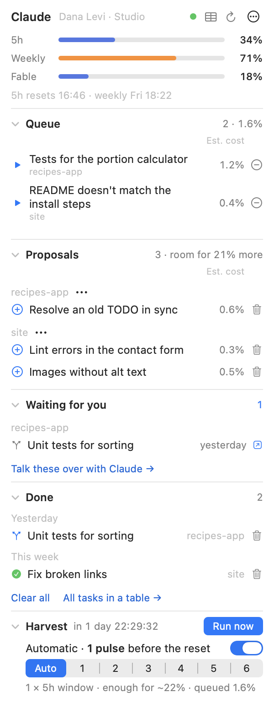

# Quota Harvest

A macOS menu bar widget for [Claude Code](https://claude.com/claude-code). It shows your plan's usage limits — the 5-hour window, the weekly limit and the per-model weekly limit — and spends the weekly quota you would otherwise lose at the reset on small tasks from your projects: each one on its own git branch, merged only when you say so.

In Hebrew or English. [עברית](README.he.md)



## What it does

- **Usage at a glance.** Three bars in the panel (or three small gauges in the menu bar), orange from 70 %, red from 90 %, with the reset times.
- **A backlog that fills itself.** Once set up, every Claude Code session (and Codex, if you use it) knows to record small, non-urgent things it notices — a missing test, a stale README, a TODO — in the project's `BACKLOG.md`, instead of doing them now or forgetting them. You can also just say "add this to the backlog".
- **Proposals you approve.** Tasks an agent records on its own arrive as proposals. ⊕ next to a proposal moves it to the queue; the trash can deletes it; a project can be kept out of proposals altogether.
- **The harvest.** Before your weekly reset the widget starts a Claude Code session that works through the queue, one task at a time, as far as the remaining quota allows — in **pulses** of one 5-hour window each, as many as you choose or as many as the quota left and the queue call for. A task that can't finish before the reset doesn't start. You can also run the queue right away.
- **When a quota runs out.** A model with its own weekly quota (Fable) gives way to another at the percent you set — before a task, and mid-task too, the session going on with its context intact. When the shared 5-hour or weekly limit runs out, the task stops at once, keeps its work on its branch and goes on from there in the next pulse.
- **Live, and on your phone.** Every run is published through Remote Control, so it appears in the Claude app — and on your phone — while it works, and you can write to it.
- **You merge.** Each task ends on its own `backlog/…` branch in its project. Nothing is pushed or merged by the harvest. "Waiting for you" opens a session that shows the change and merges it when you approve; a reminder comes if something waits too long.

## Requirements

- macOS 15 or later
- Xcode Command Line Tools (`xcode-select --install`) — for `swiftc` and `python3`
- [Claude Code](https://claude.com/claude-code), signed in with a claude.ai account (the harvest runs in its `auto` permission mode; Remote Control shows runs live)
- git

## Install

**With your AI agent:** give it this link and let it do the rest — https://github.com/yairixStudio/quota-harvest/blob/main/INSTALL-WITH-AGENT.md

**By hand:**

```sh
git clone https://github.com/yairixStudio/quota-harvest.git
cd quota-harvest
./install
```

`./install` builds the app, signs it for this Mac and starts it at login. The first time, macOS asks whether it may read the Claude Code credentials in your Keychain — choose **Always Allow**. The usage bars work from here on.

Then click **Set up the harvest…** in the panel. Setup asks for your name, the language, the folder the harvest's sessions run in, and — optionally — an email for a weekly summary. It shows exactly what it will write before writing anything:

- the harvest engine and three Claude Code skills, in `~/.claude`
- a `claude-harvest` command in `~/.local/bin`
- a short, clearly marked "Backlog" section in `~/.claude/CLAUDE.md` (and `~/.codex/AGENTS.md` if you use Codex), which teaches sessions to record tasks

Anything it replaces is backed up first. At the end it offers a short getting-started conversation in the Claude app: it finds the projects you've worked on with Claude Code, asks which ones to use, reads them without changing anything, and records a few first tasks as proposals.

## Using it

- **Queue** — approved tasks, top first, with each one's estimated share of your weekly quota. They run by priority unless you drag them into your own order. ▶ runs one now; ⊖ takes it out of the queue.
- **Proposals** — ⊕ to approve, the trash can to delete, ⋯ next to a project for "no proposals from this project".
- **Waiting for you** — finished branches and questions; a click opens a Claude session that walks you through the change.
- **Done** — the last 30 days; a click opens the session that did the task, the trash can (or **Clear all**) tidies the list.
- The **table button** at the top — **All tasks**: every task of every project in one window, with tabs, search, sortable columns, and each task's details and actions.
- **Harvest** (bottom) — the countdown to the next automatic run, **Run now**, and the schedule.
- ⋯ → **Settings…** — five tabs: **General** (language, start at login, menu bar or floating, your details), **Harvest** (automatic runs, pulses, how much of each limit is kept free for you), **Models** (a model per task size, when and to what to switch), **Projects** (which may get proposals) and **Texts** (every instruction the harvest gives its agents, editable, with the default a click away). ⋯ → **Help** explains every part of the panel.

## How it works

- The widget is a single Swift file (`QuotaHarvest.swift`, AppKit + SwiftUI, no dependencies). It reads the usage from Anthropic's API with your Claude Code sign-in, every 5 minutes at most.
- The harvest's logic is a Python engine (`harvest/home/bin/harvest.py`, standard library only) that owns the backlog files, the budget, git worktrees and branches, and the run's state. Claude Code sessions call it through the skills in `harvest/skills/`.
- `harvest/install.py` installs the engine, the skills and the instructions into your home folder and records a hash per file, so an update never overwrites something edited by hand, and removal takes out exactly what it put in.
- Each task runs as its own Claude Code session inside its project, in a git worktree, on its own branch.

## Privacy and safety

- Your Claude credentials never leave your Mac except to Anthropic: the access token only to `api.anthropic.com`, the refresh token only to Anthropic's sign-in endpoint. Nothing is logged, no analytics, no other network calls.
- The harvest never pushes, merges, deploys or deletes. Agents can't approve tasks for themselves. Text inside your code and backlog is treated as data, not instructions.

## Remove

⋯ → **Settings…** → **Remove the harvest…** takes out the engine, the skills and the marked instructions (your backlog files, history and branches stay). To remove the widget as well: turn off "Start at login" in Settings, quit it, and delete the folder.

## Develop

```sh
./start                                   # build if needed and run from this folder
python3 harvest/home/bin/test_harvest.py  # engine tests
python3 harvest/test_install.py           # installer tests
```

`AGENTS.md` has the rules for changing it (for people and coding agents alike); `SPEC.md` describes every behavior.

## License

MIT — see [LICENSE](LICENSE).
